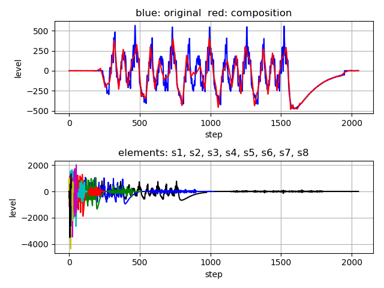
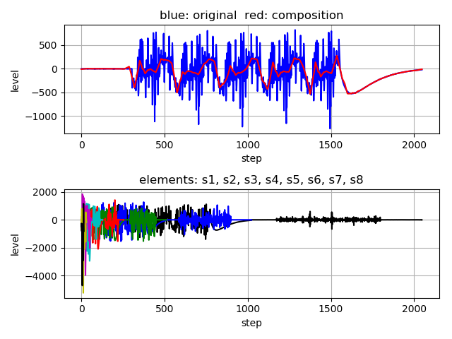

# Wavelet noise reduction    

This is a simple example of wav signal noise reduction using  Wavelet (Daubechies) transform.  


## comparison  
decompose to elements by Wavelet transform, and  
compose from selected elements except mainly noise elements by inverse Wavelet transform 

```
python3 wavelet1.py   
```

  

  


